# Data Analysis Portfolio

A collection of hands-on data analysis and machine learning projects I built to explore real-world datasets and solve practical problems. Each project is a complete story, from raw data to insights.

---

## Projects

### Project 1: Customer Segmentation (RFM Clustering)

**Directory:** [`customer-rfm-segmentation/`](customer-rfm-segmentation/)

An interactive Streamlit dashboard that groups customers into segments based on how recently they bought, how often they buy, and how much they spend. Helps businesses identify their best customers, re-engage at-risk ones, and understand what's happening with their base at a glance.

| Detail | Value |
|--------|-------|
| Technique | KMeans clustering, RFM scoring |
| Dataset | UCI Online Retail |
| Tools | Python, Pandas, Scikit-learn, Streamlit, Plotly |
| Status | Complete |

### Project 2: NLP Sentiment Analysis - IMDB Reviews

**Directory:** [`nlp-sentiment-analysis/`](nlp-sentiment-analysis/)

A complete NLP pipeline that reads movie reviews and tells you whether they're positive or negative. I trained and compared three classifiers, then picked the best one. You can test it yourself through the interactive Streamlit dashboard (run `streamlit run app.py` to launch locally).

| Detail | Value |
|--------|-------|
| Technique | TF-IDF vectorization, Logistic Regression, Naive Bayes, Random Forest |
| Dataset | Stanford IMDB Large Movie Review Dataset (50k reviews) |
| Tools | Hugging Face Datasets, Scikit-learn, NLTK, WordCloud, Plotly |
| Status | Complete |

**Results:**

| Model | Accuracy | F1 Score | ROC-AUC |
|-------|----------|----------|---------|
| **Logistic Regression** | **88.1%** | **0.882** | **0.953** |
| Multinomial Naive Bayes | ~85% | ~0.85 | ~0.93 |
| Random Forest | ~84% | ~0.84 | ~0.92 |

### Project 3: House Price Prediction — California Housing

**Directory:** [`house-price-prediction/`](house-price-prediction/)

A complete regression pipeline that predicts median house values across California census block groups. Five models compared (Linear Regression, Ridge, Lasso, Random Forest, Gradient Boosting), with the tuned Gradient Boosting achieving **R² = 0.836** and a typical prediction error of **~$10,707**. Includes feature engineering, geospatial EDA, residual analysis, and learning curves.

| Detail | Value |
|--------|-------|
| Technique | Gradient Boosting, Random Forest, Ridge/Lasso, feature engineering |
| Dataset | California Housing (sklearn) — 20,640 block groups |
| Tools | Scikit-learn, Pandas, Matplotlib, Seaborn |
| Status | Complete |

**Results:**

| Model | R² Score | MAE (log) | RMSE (log) |
|-------|----------|-----------|------------|
| **Gradient Boosting (tuned)** | **0.8363** | **0.1017** | **0.1436** |
| Random Forest (50) | 0.8149 | 0.1073 | 0.1527 |
| Ridge (alpha=1.0) | 0.6721 | 0.1525 | 0.2033 |
| Linear Regression | 0.6721 | 0.1525 | 0.2033 |

| Key finding | The engineered `IncomePerRoom` feature dominates (43.8% importance) — neighborhood affluence density predicts price better than income alone. |

### Project 4: Wine Quality Classification

**Directory:** [`wine-quality-classification/`](wine-quality-classification/)

A complete classification pipeline predicting red wine quality (0–10) from 11 physicochemical properties. Two approaches: binary (good wine >= 7 vs. poor) with four models compared, and multi-class exact score prediction. Random Forest achieves the best recall (58%) and ROC-AUC (0.955).

| Detail | Value |
|--------|-------|
| Technique | Random Forest, Gradient Boosting, Logistic Regression, SVM, feature importance analysis |
| Dataset | UCI Wine Quality — 1,599 red wine samples |
| Tools | Scikit-learn, Pandas, Matplotlib, Seaborn |
| Status | Complete |

**Results:**

| Model | Accuracy | F1 Score | ROC-AUC |
|-------|----------|----------|---------|
| **Random Forest** | **93.8%** | **0.714** | **0.955** |
| Gradient Boosting | 93.1% | 0.703 | 0.916 |
| SVM (RBF) | 90.0% | 0.500 | 0.889 |
| Logistic Regression | 89.4% | 0.485 | 0.880 |

| Key finding | Alcohol content (17.4%), sulphates (11.1%), and volatile acidity (10.2%) are the strongest predictors — confirming domain knowledge in oenology. |

### Visual Gallery

| Confusion Matrices | Review Length Distribution |
|:---:|:---:|
| 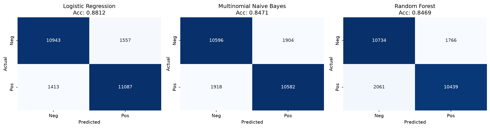 | 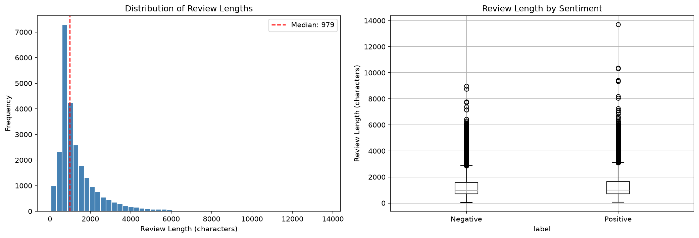 |

| Positive Reviews Word Cloud | Negative Reviews Word Cloud |
|:---:|:---:|
| 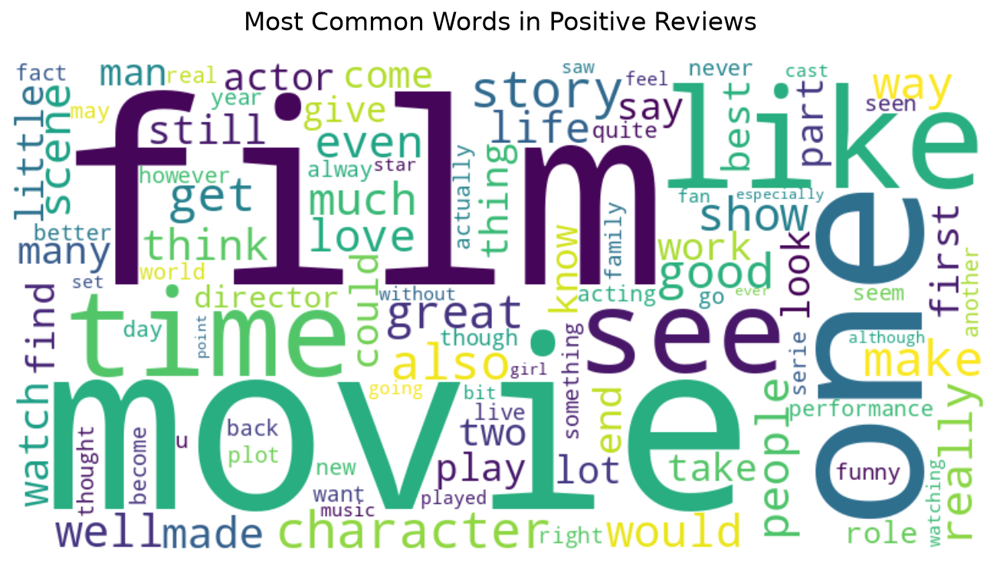 | 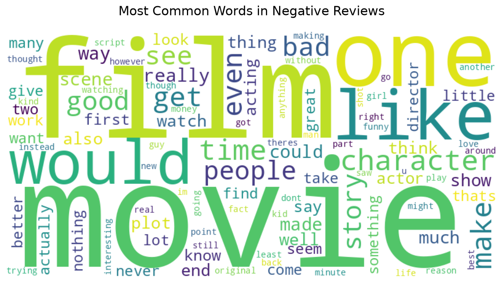 |

**Top Predictive Features:**

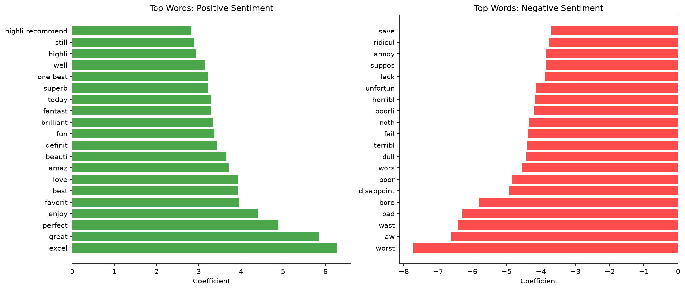

### Wine Quality —  Charts

| Quality Distribution | ROC Curves |
|:---:|:---:|
| 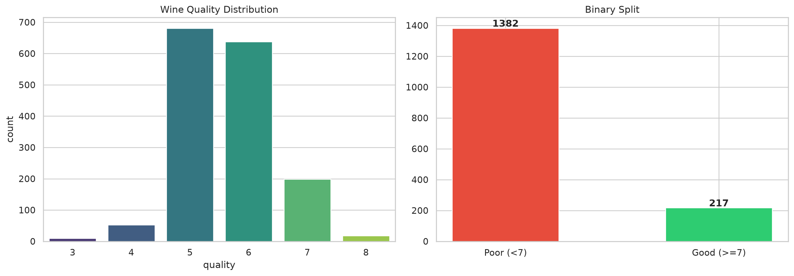 | 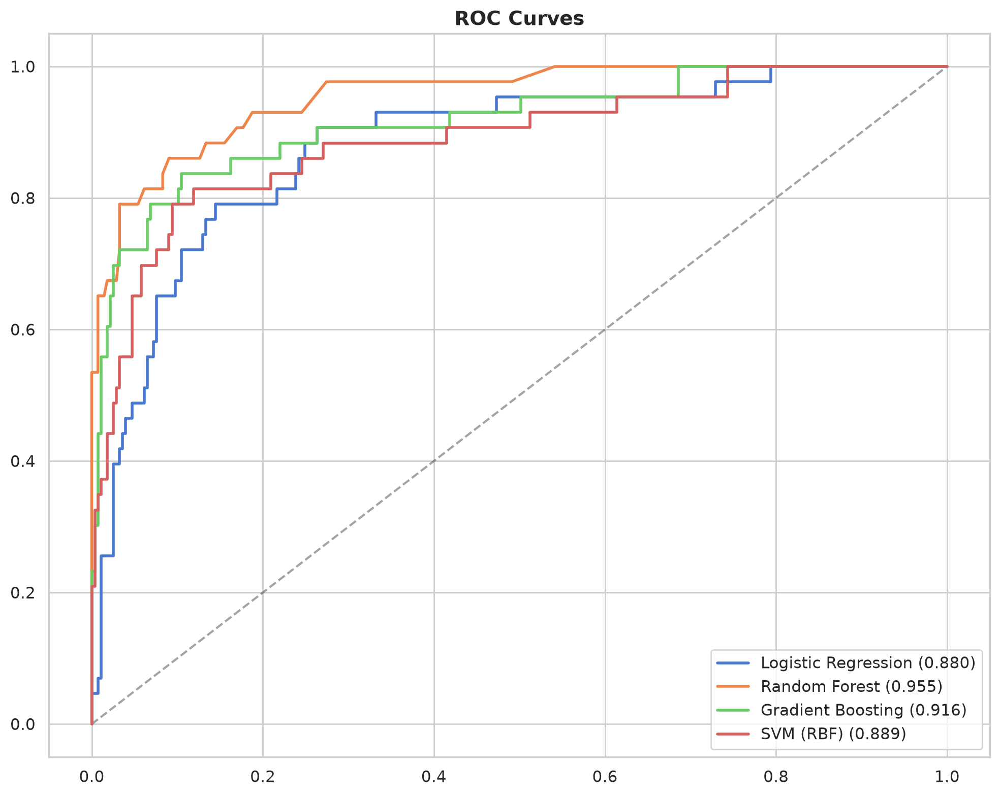 |

| Feature Importance | Model Comparison |
|:---:|:---:|
| 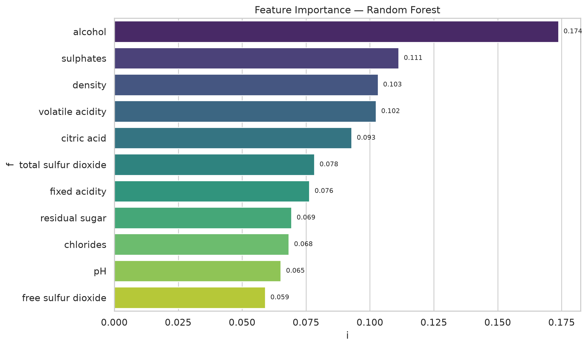 | 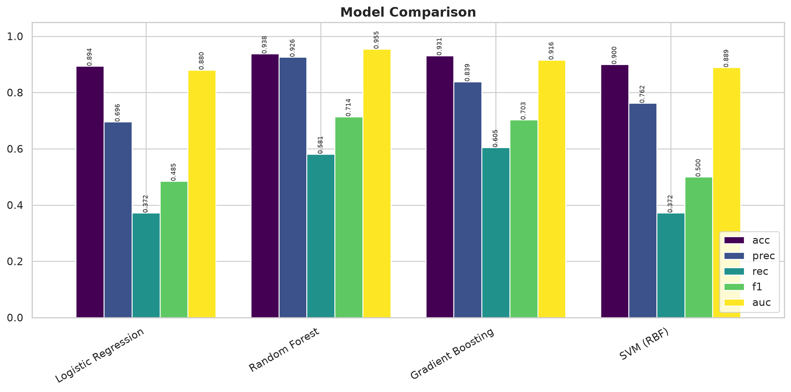 |

| Confusion Matrix (Best Model) | Multi-Class Matrix |
|:---:|:---:|
| 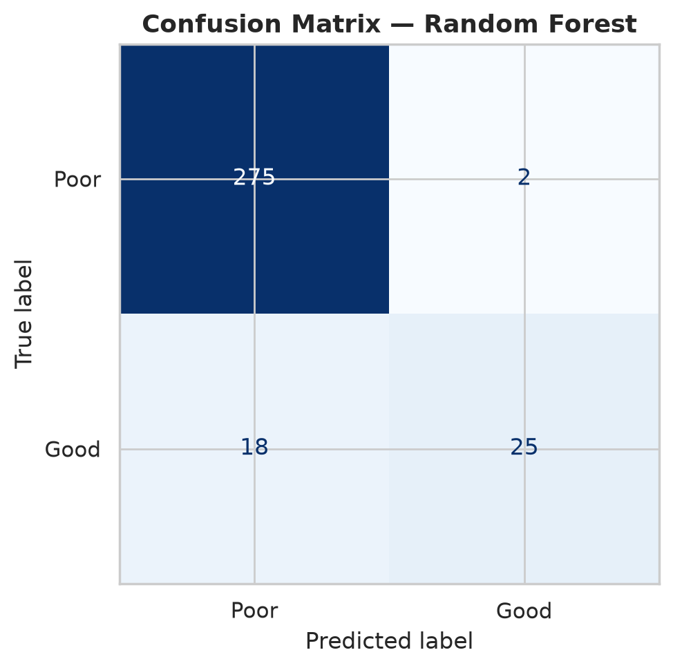 | 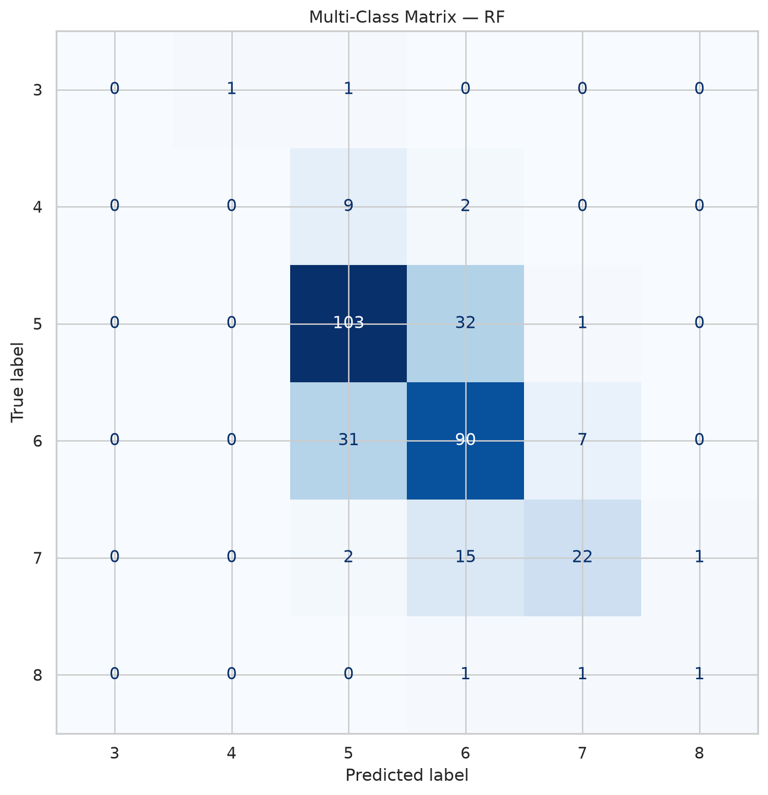 |

---

## Quick Start

```bash
# Clone the repo
git clone https://github.com/Venkata-Manoj/data-analysis.git
cd data-analysis

# Project 1: Customer Segmentation
cd customer-rfm-segmentation
pip install -r requirements.txt
streamlit run app.py

# Project 2: NLP Sentiment Analysis
cd nlp-sentiment-analysis
pip install -r requirements.txt
jupyter notebook sentiment_analysis_executed.ipynb
# Or launch the interactive dashboard:
streamlit run app.py

# Project 4: Wine Quality Classification
cd wine-quality-classification
pip install -r requirements.txt
python analysis.py
```

## Tech Stack

- **Languages:** Python 3.11+
- **Data:** Pandas, NumPy
- **ML:** Scikit-learn, NLTK
- **Visualisation:** Matplotlib, Seaborn, Plotly, WordCloud
- **Notebooks:** Jupyter
- **Datasets:** Hugging Face Datasets, UCI Repository, sklearn datasets

## License

MIT - feel free to use, modify, and share.
