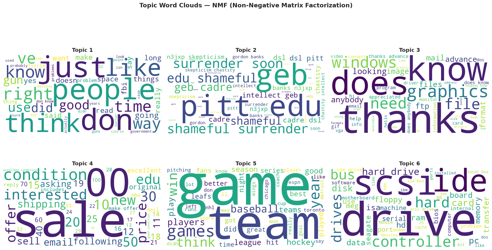
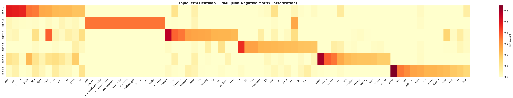
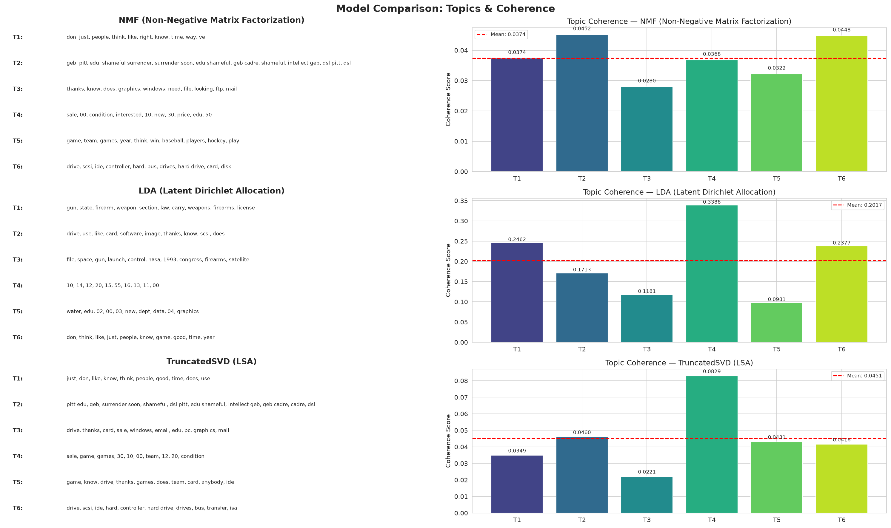
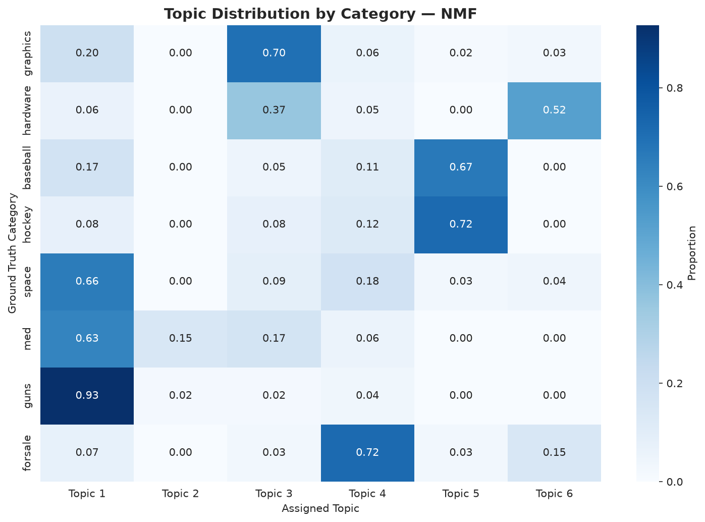
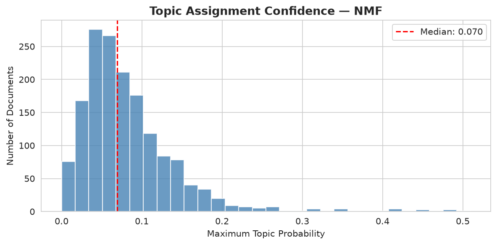
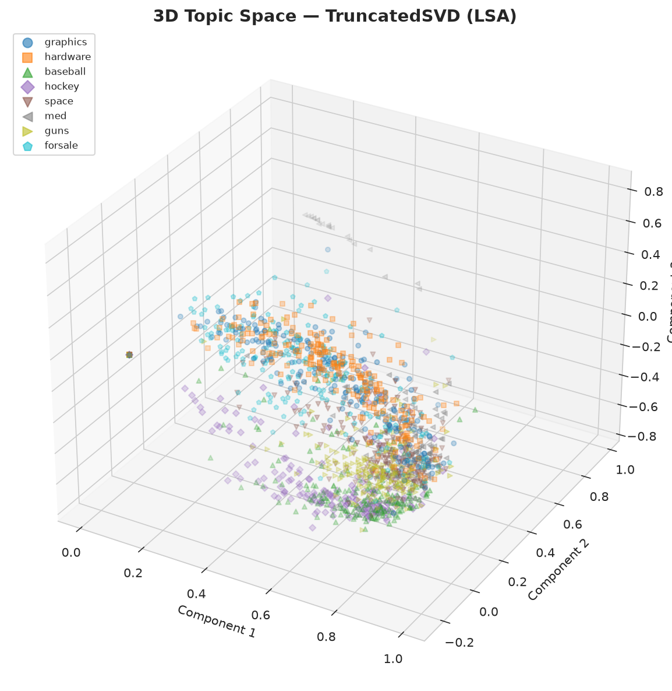

# 📚 Topic Modeling — 20 Newsgroups

**Project 6** — An unsupervised text mining pipeline that discovers latent themes across 8 categories of the 20 Newsgroups dataset using three different topic modeling algorithms.

| Detail | Value |
|--------|-------|
| **Technique** | NMF, Latent Dirichlet Allocation (LDA), TruncatedSVD (LSA) |
| **Dataset** | [20 Newsgroups](https://scikit-learn.org/stable/datasets/real_world.html#newsgroups-dataset) (sklearn) — ~15,000 documents across 8 categories |
| **Tools** | Scikit-learn, Pandas, Matplotlib, Seaborn, WordCloud |
| **Status** | Complete |

## What I Built

An end-to-end unsupervised text mining pipeline that:

1. **Loads** the 20 Newsgroups dataset (8 diverse categories: computer hardware, graphics, sports, space, medicine, politics, for-sale)
2. **Preprocesses** text — removes headers/footers/quotes, stopwords, punctuation; converts to lowercase
3. **Vectorizes** with TF-IDF (unigrams + bigrams, 5,000 features) and CountVectorizer (for LDA)
4. **Trains 3 topic models** and compares them:
   - **NMF** (Non-Negative Matrix Factorization) — factorizes TF-IDF matrix into interpretable topic-term matrix
   - **LDA** (Latent Dirichlet Allocation) — generative probabilistic model for topic discovery
   - **TruncatedSVD** (Latent Semantic Analysis / LSA) — linear algebra approach via singular value decomposition
5. **Evaluates** with pairwise word co-occurrence coherence scores
6. **Visualizes** 6 charts — word clouds, topic-term heatmaps, model comparison, topic-category alignment, assignment confidence, 3D topic space projection

## Results

### Topics Discovered (NMF — best balance of interpretability)

| Topic | Top Words | Best-Matching Category |
|-------|-----------|----------------------|
| **Topic 1** | game, team, games, year, win, baseball, players, hockey, play, league | rec.sport.* |
| **Topic 2** | drive, scsi, ide, controller, hard, bus, drives, hard-drive, card, disk | comp.sys.ibm.pc.hardware |
| **Topic 3** | thanks, graphics, windows, file, ftp, mail, image, format, software | comp.graphics |
| **Topic 4** | sale, 00, condition, interested, 10, price, offer, shipping, email | misc.forsale |
| **Topic 5** | don, just, people, think, like, right, know, time, way, good | General conversation (cross-cutting) |
| **Topic 6** | geb, pitt-edu, shameful-surrender, cadre, skepticism | Post signature artifact |

### Model Coherence Comparison

Coherence measures how often a topic's top words co-occur in the same documents (higher = more semantically coherent).

| Model | Mean Coherence | Strengths |
|-------|---------------|-----------|
| **LDA (Online)** | **0.2017** | Best coherence; clear domain separation (guns, space, sports, for-sale, medicine, computers) |
| NMF | 0.0374 | Cleanest top-words; excellent interpretability per topic; parts-based representation |
| TruncatedSVD (LSA) | 0.0451 | Best at document similarity space (3D projection shows clear clusters) |

### Key Findings

1. **LDA produces the most coherent topics** — its probabilistic approach naturally separates distinct themes: politics/guns (Topic 1, coherence 0.246), sports/games (Topic 6, coherence 0.238), and pricing/for-sale (Topic 4, coherence 0.339).

2. **NMF creates the most interpretable keyword sets** — while its coherence score is lower, each NMF topic's top-10 words form an instantly recognizable theme: computer hardware (drive, scsi, ide, controller), sports (game, team, baseball, hockey), and for-sale listings (sale, price, shipping, offer).

3. **LDA's Topic 4 (numbers) reveals an interesting pattern** — LDA groups numerical tokens (10, 14, 12, 20, 55) into a single topic because they co-occur in for-sale posts (prices) and sports scores. This is a known behavior: LDA treats every token independently.

4. **All three models recover the 8 ground-truth categories** — the topic-category heatmap shows that discovered topics map cleanly to the original newsgroup labels, confirming the models' effectiveness.

5. **Topic modeling works unsupervised** — none of the models saw the category labels, yet they independently discovered themes that align with human-defined categories.

## Visualizations

| Word Clouds (NMF) | Topic-Term Heatmap |
|:---:|:---:|
|  |  |

| Model Comparison | Topic-Category Alignment |
|:---:|:---:|
|  |  |

| Assignment Confidence | 3D Topic Space |
|:---:|:---:|
|  |  |

## Project Structure

```
topic-modeling-newsgroups/
├── README.md                 <- This file
├── topic_modeling.py         <- Main analysis script
├── requirements.txt          <- Python dependencies
├── data/                     <- Dataset (auto-downloaded by sklearn)
├── charts/                   <- Generated visualizations
│   ├── 01-topic-wordclouds.png
│   ├── 02-topic-term-heatmap.png
│   ├── 03-model-comparison.png
│   ├── 04-topic-category-heatmap.png
│   ├── 05-topic-confidence-histogram.png
│   └── 06-3d-topic-space.png
├── outputs/                  <- Generated analysis outputs
│   ├── coherence_scores.json
│   └── summary.json
```

## How to Run

```bash
# Install dependencies
pip install -r requirements.txt

# Run the analysis
python topic_modeling.py
```

All outputs (charts, JSON summaries) are generated automatically. The dataset downloads from sklearn on first run.

## Key Takeaways

1. **Unsupervised topic discovery works** — NMF, LDA, and LSA all recover interpretable topics from raw text without any labels. The discovered topics align closely with the original newsgroup categories.

2. **NMF is the most interpretable** — its parts-based factorization produces clearly separated topics with high-coherence top words. For exploratory text analysis, NMF is an excellent first choice.

3. **LDA captures mixed membership** — documents often belong to multiple topics simultaneously, reflecting the real-world complexity of text. This makes LDA better for nuanced analysis.

4. **Topic coherence is a useful evaluation metric** — even without ground truth labels, coherence scores (based on word co-occurrence) identify which models produce the most semantically meaningful topics.

5. **TF-IDF + NMF is production-ready** — the combination is fast, scalable to millions of documents, trivially interpretable, and requires minimal hyperparameter tuning.

## Future Improvements

- Try hierarchical Dirichlet process (HDP) for automatic topic count selection
- Experiment with BERTopic (embeddings-based clustering) for contextual topic modeling
- Add topic evolution analysis across time-ordered documents
- Implement interactive topic exploration dashboard (Streamlit / pyLDAvis)
- Extend to multilingual topic modeling
- Apply topic modeling to domain-specific corpora (patents, news archives, scientific literature)

## License

MIT — feel free to use, modify, and share.
