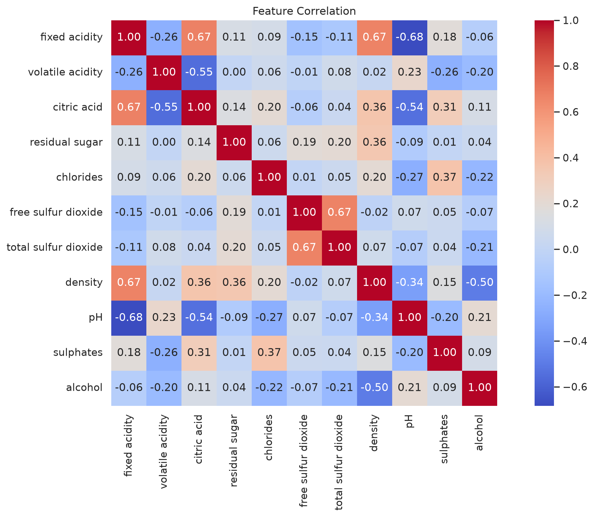
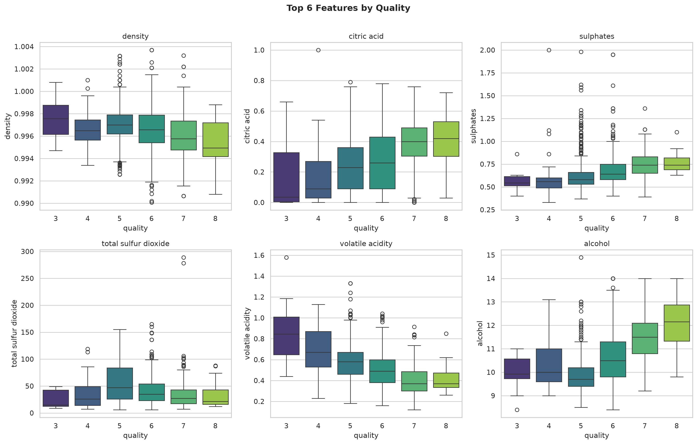

# Wine Quality Classification 🍷

**Project 4** — A complete ML classification pipeline predicting red wine quality (0–10 scale) from 11 physicochemical properties. Multi-class (exact score) and binary (good/poor) approaches compared.

| Detail | Value |
|--------|-------|
| Technique | Logistic Regression, Random Forest, Gradient Boosting, SVM |
| Dataset | [UCI Wine Quality](https://archive.ics.uci.edu/dataset/186/wine+quality) (red wine, 1,599 samples) |
| Tools | Python, scikit-learn, Pandas, Matplotlib, Seaborn |
| Status | Complete |

---

## Objective

Predict the quality of Portuguese red wine (score 0–10) based on its chemical composition — acidity, sugar, alcohol, sulfur compounds, etc. Two formulations:

1. **Binary classification:** Good wine (quality >= 7) vs. Poor wine (< 7)
2. **Multi-class classification:** Exact quality score (3–8 range covering 99% of samples)

---

## Methodology

### Preprocessing
- Standard scaling of all 11 numerical features
- Stratified train/test split (80/20)
- Class imbalance addressed through evaluation metrics (precision, recall, F1, ROC-AUC)

### Models Compared
| Model | Binary Acc | Binary F1 | Binary AUC |
|-------|-----------|-----------|------------|
| Logistic Regression | 0.8938 | 0.4848 | 0.8804 |
| **Random Forest** 🏆 | **0.9375** | **0.7143** | **0.9547** |
| Gradient Boosting | 0.9313 | 0.7027 | 0.9160 |
| SVM (RBF) | 0.9000 | 0.5000 | 0.8892 |

**Winner:** Random Forest achieves the best recall of good wines (58%) and highest ROC-AUC (0.955), indicating strong discriminative power despite class imbalance.

### Key Findings
- **Top predictors:** `alcohol` (17.4% importance), `sulphates` (11.1%), `density` (10.3%), `volatile acidity` (10.2%), `citric acid` (9.3%)
- Wines with higher alcohol, lower volatile acidity, and higher sulphates consistently score better
- Multi-class exact-score prediction is challenging (68% accuracy) — the problem is naturally ordinal with subtle feature differences between adjacent quality scores

---

## Charts Gallery

| Chart | Description |
|-------|-------------|
|  | Quality score distribution & binary split |
|  | Feature correlation heatmap |
|  | Top 6 features by quality score |
|  | ROC curves for all binary classifiers |
|  | Model performance comparison |
|  | Confusion matrix — best model |
|  | Feature importance — Random Forest |
|  | Multi-class confusion matrix |

---

## Running It

```bash
# Install dependencies
pip install pandas scikit-learn matplotlib seaborn xgboost

# Run the full pipeline
python analysis.py
```

Outputs:
- **`charts/`** — 8 publication-quality PNG figures
- **`outputs/results_summary.md`** — numeric results summary
- Console prints timing and metrics per model

---

## What I Learned

- Class imbalance (86% poor / 14% good) makes recall the critical metric — a naive classifier that always predicts "poor" would achieve 86% accuracy but 0% recall
- Random Forest handles this imbalance better than linear models or SVM
- The wine quality problem is genuinely hard for exact multi-class prediction — adjacent scores (e.g., 5 vs 6) have very similar chemistry, making fine-grained distinctions difficult
- Feature importance analysis confirms domain knowledge: alcohol and volatile acidity are well-known quality indicators in oenology

---

## Future Improvements

- **SMOTE / class weighting** to address imbalance directly during training
- **Ordinal regression** (e.g., scikit-learn's `HistGradientBoostingClassifier` with ordinal loss)
- **Deep learning** (small neural net for ordinal regression)
- **Cross-validation** for more robust performance estimates
- **Ensemble** of RF + Gradient Boosting + tuned SVM
- **Model calibration** analysis for probability estimates
